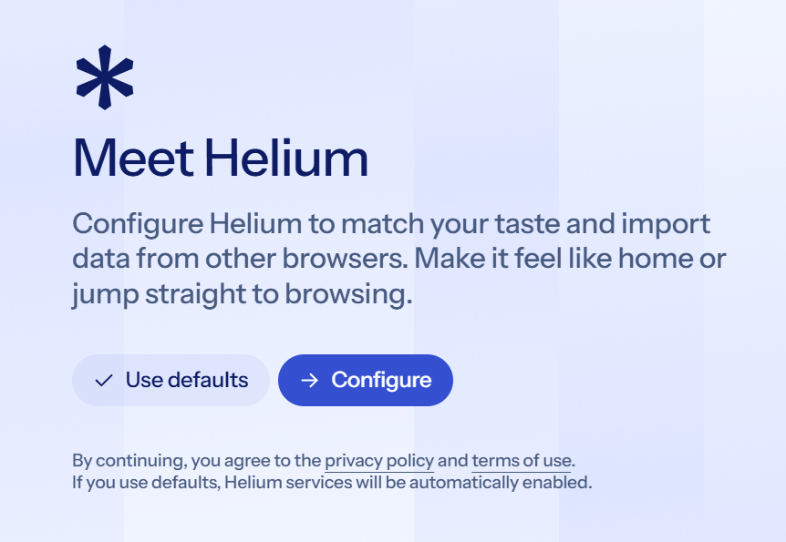
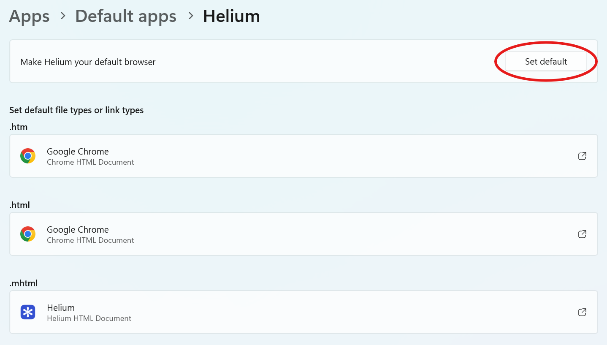

Helium is the browser I recommend for this setup. It has very good default settings and is easy to set up.

## Installing Helium

Go to the [Helium website](https://helium.computer/) and click the download button. Run the downloaded installer and follow the instructions. Once it's installed, you might want to pin it to your taskbar. Open Helium when it's finished installing.

## Initial Setup

You will see this screen:\

Click the _Configure_ button.

### Helium serivces
Leave these set to the default settings. They're needed for quite a few basic features, and they don't harm your privacy. These settings are mostly for extremely advanced users who need the browser to minimize its network activity.

### Choose a search engine
Choose the search engine you prefer. I recommend using Startpage because it's as good as Google and doesn't have the tracking, but Google is also a popular choice (but keep in mind that it has all of Google's tracking). DuckDuckGo is decent, but the search results aren't as good as Google. Startpage actually gets its search results from Google, and it doesn't track you, so it's a good choice.

### Importing from another browser
If you've already used another browser, you can import all your bookmarks and history. Just click on the browser profile you want to import from. If you don't want to keep your existing bookmarks, click _Next_ without selecting anything.

### Choosing a password manager
Unlike other browsers, Helium doesn't have the option to save your passwords. This is actually a good thing because passwords saved in web browsers can be easily accessed by malware. Instead, it will offer to install a password manager extension. I'm working on a [password manager guide](../privacy-security/password-managers.md), but long story short, I recommend Bitwarden (for online storage) or KeePassXC (for offline storage).

If you know which password manager you want, click on its _Install_ button. Otherwise, just click _Next_.

### Change your default browser
You will be asked if you want to set Helium as your default browser. I recommend doing this if you plan to use Helium as your primary browser. If you are just trying it out, click _No_.

If you choose to set Helium as your default browser, a settings window will open (assuming you're using Windows):\

Click the _Set default_ button (circled in the above screenshot), then close the settings window.

When you're finished the initial setup, click the _Let's Go_ button to go to your New Tab page.

## Changing Settings
After completing the initial setup, there are some settings you'll want to change.

Click the 3 dots in the top-right corner, then click _Settings_.

### Appearance and behaviour
Unless you really like it, turn off _Show a rounded frame around web content_. It doesn't look good and it causes problems with a few websites (at least, it does in Edge).

Depending on your preferences, you might want to change the following settings:

- **Show Home button** - Shows a home button next to the refresh button.
- **Bookmarks bar** - Some people will want to change this to _Always show_.
- **Customize your toolbar** - If you want to, you can add extra icons to your toolbar.

### Privacy and security
Almost all of the default settings in this section are really good, but there are 2 things you should change:

- **Network and security >> Global Privacy Control (GPC)** - Turn this on.
- **Network and security >> Send a "Do Not Track" signal with your browsing traffic** - Turn this on.

### Search engine
If you want to, turn on _Suggestions from the search engine_.

### Languages
Canadians might want to change these settings, but the defaults are fine for most people.\
If you're Canadian, you can add _English (Canada)_ to your language list and move it to the top. Remember to also enable it for spell check.

### Downloads
There's one thing to change here, and it all depends on your personal preference.

If you want a _Save as_ popup to appear when you download a file (to choose where to save it), turn on _Ask where to save each file before downloading_. If you want downloads to always go to your _Downloads_ folder, leave it turned off.

